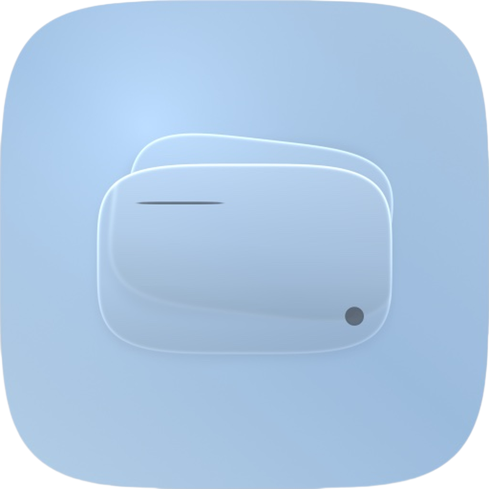

<p align="center">
  
</p>

<h1 align="center">Vitrea</h1>

<p align="center">
  <b>Apple Wallet 卡面工坊</b> —— 在 iPhone 上直接为 Apple Wallet 卡片换上自定义卡面，<br/>
  无需越狱、无需电脑、不触碰任何支付凭据。
</p>

<p align="center">
  
  
  
  
  
</p>

<p align="center">
  <a href="../../releases/latest"></a>
  <a href="docs/INSTALL.md"></a>
</p>

---

## 简介 / Overview

**Vitrea**（原名 *卡面工坊*）是一款运行在 iPhone 本机的 Apple Wallet 卡面自定义工具。它在线浏览卡面素材库、把照片裁剪成与卡面等比的画布、叠加文字与贴纸，最后把成图写入 Apple Wallet 的图像缓存，让钱包里的银行卡、交通卡、证件卡立刻换上你想要的样子。

整个写入过程**在设备上完成**：App 通过本地回环隧道（`10.7.0.1` / `127.0.0.1`，由 LocalDevVPN 提供）与本机系统服务通信，实际的文件操作由 `AirliftFFI`（`rust-core/`）负责。全程**不越狱、不访问 Secure Enclave、不读取或修改任何支付凭据**，只替换 Wallet 的图像缓存文件。

> [!IMPORTANT]
> **兼容性**：Vitrea 需要 **iOS 18.0 或更高版本**，且必须配合 [LocalDevVPN](https://github.com/OWNER/localdevvpn) 建立本地回环隧道才能完成写入。

## 功能特性 / Features

### 🎨 卡面库（在线素材）
- 从 [cardart.cc](https://cardart.cc) 在线拉取卡面素材，瀑布流浏览，支持**下拉刷新**与分页加载。
- 按类别筛选：**交通卡**（`type=transit`）、**证件卡**（`type=id`）、**支付卡**（`type=payment`）。
- **精选推荐**板块，首页直达高质量卡面。
- **作者作品页**：点进任意作者即可浏览其全部作品。
- 图片多级缓存（内存 + 磁盘），滚动流畅不重复请求。

### ✂️ 卡面编辑器
- **照片裁切**：上传照片后进入裁切模式，编辑框严格等于卡面真实比例（**1536 × 969**）。可拖动、双指缩放，并自动约束「始终填满框体」，由你确认保留区域后再进入编辑。
- **编辑区域隔离**：所有文字、贴纸等编辑操作都只在卡面框内部完成，不会在整屏范围内编辑，框体与底部操作区互不遮挡。
- **文字排版**：字体、字号、颜色、描边、阴影、位置自由调整。
- **贴纸系统**：内置按 `airlines / banks / cars / flags / ids / networks / schools / tiers / transit / other` 分类的贴纸库（清单约 580 KB，图片在线加载）。
- 导出分辨率锁定为 **1536 × 969**，与 Wallet 缓存所需的 `cardBackgroundCombined` 尺寸一致。

### 💳 写入与配对
- 实时检测 Apple Pay 唤起的卡片标识，精确匹配目标卡。
- 写入前显示**实时进度百分比**，动画平滑。
- 写入完成后自动刷新正反面与缩略图缓存，Wallet 打开即为新卡面。
- **开发者配对**：通过 Bonjour（`_remotepairing-pairable-host._tcp`）与本机完成配对，支持 PIN 校验流程。

### 🪟 界面
- 基于 iOS 26 **液态玻璃（Liquid Glass）** 的视觉风格，自绘 `GlassCard` / `GlassButton` / `GlassBackground` 组件。
- 底部 Tab 导航：**卡面库** / **作者**，编辑器以全屏方式独立呈现，不占用 Tab。

## 预览 / Preview

> 📷 **截图待补充**：把实机截图放到 `docs/screenshots/` 下（建议命名 `gallery.png` / `crop.png` / `editor.png` / `write.png`），然后取消下面这段的注释即可。

<!--
<p align="center">
  
  
  
  
</p>
-->

| 界面 | 说明 |
| --- | --- |
| **卡面库** | 在线素材瀑布流，交通卡 / 证件卡 / 支付卡分类 + 精选推荐 |
| **照片裁切** | 严格 1536 × 969 卡面比例裁切框，拖动 / 双指缩放，确认后进入编辑 |
| **卡面编辑** | 框内叠加文字与贴纸，实时预览最终效果 |
| **写入进度** | 显示写入百分比，完成后自动刷新 Wallet 缓存 |

## 环境要求 / Requirements

| 项目 | 要求 |
| --- | --- |
| 设备系统 | **iOS 18.0+**（真机，不支持模拟器） |
| 架构 | `arm64`（模拟器仅 `arm64`，已排除 `x86_64`） |
| 开发工具 | Xcode 16+ / Swift 5.0 |
| 工程生成 | [XcodeGen](https://github.com/yonaskolb/XcodeGen)（`brew install xcodegen`） |
| Rust 工具链 | `rustup` + `aarch64-apple-ios`、`aarch64-apple-ios-sim` |
| 依赖 | [LocalDevVPN](https://github.com/OWNER/localdevvpn)（写入时提供本地回环隧道） |

## 安装 / Installation

### 方式一：直接安装 Release 中的 IPA（推荐）

1. 前往本仓库的 [**Releases**](../../releases/latest) 页面，下载最新的 `Vitrea.ipa`。
2. 因为 Release 中的 IPA 是**未签名**包，需要用自签工具重签后再安装，详见 **[docs/INSTALL.md](docs/INSTALL.md)**。
3. 常用自签工具：**AltStore / SideStore / Sideloadly / ESign / TrollStore（iOS 17 以下）/ 爱思助手**。
4. 安装完成后，按 [docs/INSTALL.md](docs/INSTALL.md) 的说明安装并启动 **LocalDevVPN**，建立回环隧道。

> [!WARNING]
> Release 中的 `Vitrea.ipa` **不包含任何签名与描述文件**（CI 打包时已剥离 `_CodeSignature` 与 `embedded.mobileprovision`），无法直接双击安装。你必须用自己的 Apple ID / 证书重签。**请勿使用来源不明的企业证书**，也不要把它交给第三方代签。

### 方式二：从源码构建（见下一节）

## 从源码构建 / Building

```bash
# 1. 克隆仓库
git clone https://github.com/<owner>/vitrea.git
cd vitrea

# 2. 构建 Rust 静态库并打包 AirliftFFI.xcframework
#    （首次会 rustup target add，耗时较长）
./build-ios.sh

# 3. 安装 XcodeGen 并生成 Xcode 工程
brew install xcodegen
xcodegen generate

# 4. 打包未签名 IPA → build/Vitrea.ipa
./build-ipa.sh Release
```

产物位于 `build/Vitrea.ipa`。若要直接跑在真机上，用 Xcode 打开 `Vitrea.xcodeproj`，在 *Signing & Capabilities* 中选择你自己的 Team 后运行即可。

### 打包脚本说明

| 脚本 | 作用 |
| --- | --- |
| `build-ios.sh` | 交叉编译 `rust-core/`，产出 `AirliftFFI.xcframework`（`aarch64-apple-ios` + `aarch64-apple-ios-sim`）。`rust-core/` 变更后需重跑，并重新 `xcodegen generate`。 |
| `build-ipa.sh [Debug\|Release]` | 调用 `xcodebuild` 构建 `Vitrea.app`，剥离签名后打包为未签名 `build/Vitrea.ipa`。 |
| `project.yml` | XcodeGen 工程定义（Bundle ID `cc.cardart.workshop`、版本号、依赖、链接参数）。 |

## 工作原理 / How it works

1. **素材层**：`CardArtAPI` 请求 `cardart.cc` 的卡面接口，`ImageCache` 做内存 + 磁盘两级缓存，`StickerService` 从 `Resources/Manifests/stickers.json` 读取贴纸索引、图片按需在线加载。
2. **编辑层**：`CropView` 把照片按卡面比例（1536 × 969）裁切并扁平化，`EditorView` 在等比例画布上叠加文字与贴纸，`SVGRenderer` 负责矢量绘制。
3. **写入层**：`WriteEngine` 通过 `AirliftFFI`（Rust）与本机 `AirTraffic` 服务通信，替换 Passbook 缓存中的 `cardBackgroundCombined@3x.png` / `@2x.png` / `.pdf`，并刷新正反面与缩略图缓存。
4. **配对层**：`PairingController` 用 Bonjour 广播 `_remotepairing-pairable-host._tcp` 完成开发者配对，`PINNotifier` 在配对期间以音频后台保活，保证输入 PIN 时不被系统挂起。

> [!WARNING]
> 本项目的写入能力依赖**未公开的系统接口**，仅在特定 iOS 版本上验证可用。系统更新后行为可能失效，这是预期内的风险。

## 目录结构 / Repository structure

```text
.
├── ios-app/                     # SwiftUI 应用源码
│   ├── App/                     # 应用入口（VitreaApp.swift）
│   ├── Glass/                   # 液态玻璃组件（GlassCard / GlassButton / GlassBackground / GlassTheme）
│   ├── Services/                # 网络 / 写入 / 缓存 / 渲染 / 配对服务
│   ├── Views/                   # 全部界面（卡面库、编辑器、裁切、写入、作者页…）
│   ├── Resources/
│   │   ├── Manifests/           # 素材与贴纸清单 JSON
│   │   └── credits/             # 作者头像
│   ├── Assets.xcassets/         # App 图标
│   ├── Models.swift             # 数据模型
│   └── Info.plist               # 权限与 Bonjour 声明
├── rust-core/                   # AirliftFFI：与本机服务通信的 Rust 静态库源码
├── project.yml                  # XcodeGen 工程定义
├── build-ios.sh                 # 构建 Rust xcframework
├── build-ipa.sh                 # 打包未签名 IPA
├── docs/
│   └── INSTALL.md               # 签名与安装指引
├── .github/                     # Issue 模板
├── RELEASE_NOTES.md             # 发布说明
├── CONTRIBUTING.md              # 贡献指南
├── LICENSE                      # MIT
└── README.md
```

## 贡献者 / Contributors

本项目由两位开发者共同研发：

<table>
  <tr>
    <td align="center" width="50%">
      <br/>
      <b>矜火</b><br/>
      <sub>构想与 Bug 修复</sub><br/>
      <a href="https://github.com/ksjinhuo">@ksjinhuo</a>
    </td>
    <td align="center" width="50%">
      <br/>
      <b>Lucky</b><br/>
      <sub>制作与构建</sub><br/>
      <sub>项目发起人</sub>
    </td>
  </tr>
</table>

欢迎通过 Issue / PR 参与共建，详见 [CONTRIBUTING.md](CONTRIBUTING.md)。

## 致谢 / Acknowledgements

- **[AirCard-iOS](https://github.com/OWNER/AirCard-iOS)** —— Vitrea 的写入链路与 `AirliftFFI` 源自该项目（MIT），感谢原作者 *Johnny Franks* 的开源工作。
- **[cardart.cc](https://cardart.cc)** —— 卡面素材来源，素材版权归原作者所有。
- **[LocalDevVPN](https://github.com/OWNER/localdevvpn)** —— 提供本地回环隧道。
- **[XcodeGen](https://github.com/yonaskolb/XcodeGen)** —— 工程文件生成。

## 许可 / License

本项目基于 [MIT License](LICENSE) 开源，仅供**个人学习与技术交流**，请勿用于商业用途或任何违规场景。

卡面素材版权归原作者所有；本 App 不对写入结果作任何保证，使用后果由使用者自行承担。
